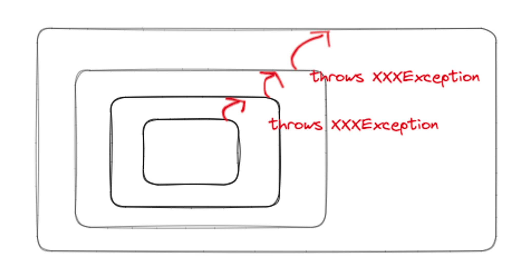
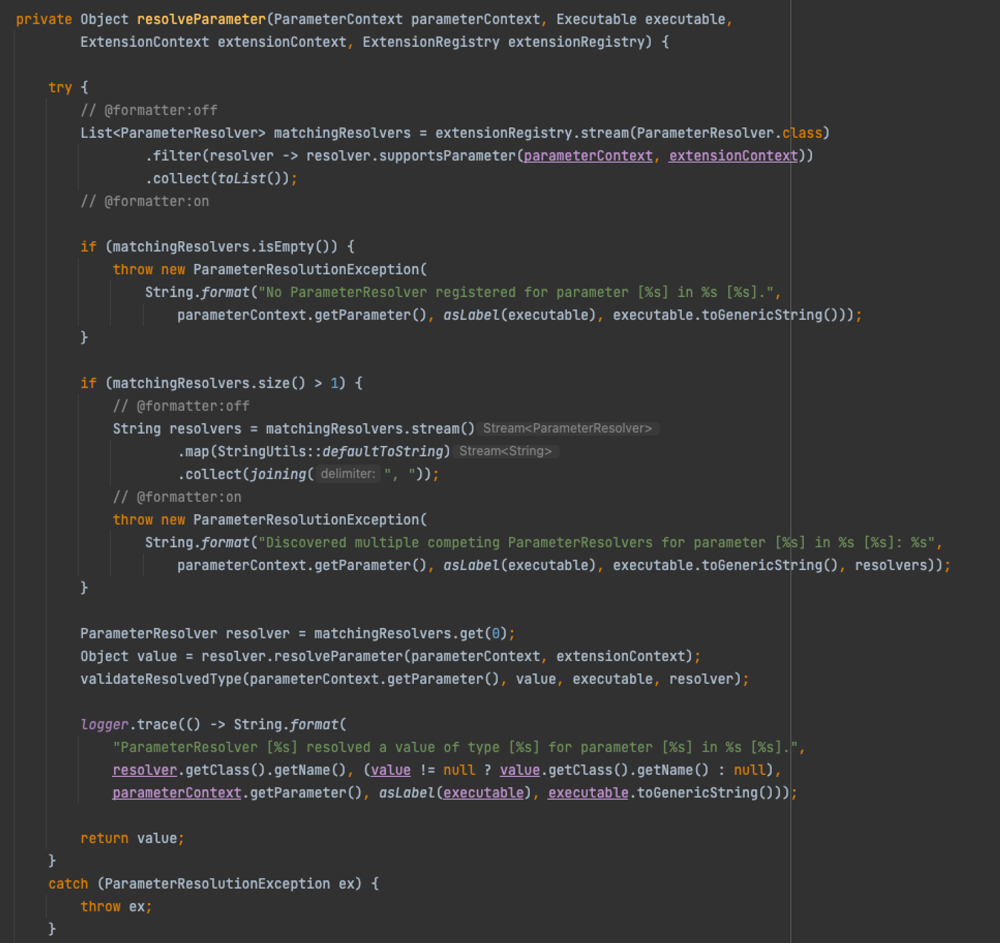

클린코드를 얘기하는데 왜 갑자기 “오류처리” 가 나왔을까?

프로그램을 만드는데 있어 “오류처리는 필수적” 이다.

하지만 여기 저기 흩어진 오류 처리 코드 때문에 실제 코드가 하는 일을 파악하기 어려운 경우가 많다.

가독성 있는 우아한 오류 처리 코드로 “실제 프로그램이 하는 일”과 잘 분리하자.

프로그램이 하는 일 을 파악하기 쉬운 깨끗한 코드 를 만들 방법을 찾아보자

## 오류 코드 보다 예외를 사용하라

요즘 프로그래밍 방식에 익숙한 사람들은 이렇게 말할 것 같다. 아니 특히 Spring 에 익숙한 사람들이라면

> 예외를 사용하지 않고 어떻게 오류 처리를 한다는 거야?
>
- 옛날: **함수에서 “오류 코드” 를 반환 → 호출자 는 “리턴 값에 따라” 오류 가 났는지 성공했는지 알 수 있었다**
    - 단점
        - 호출자 코드가 복잡 해짐(수 많은 if else 문)
        - 리턴값 이 무엇을 의미하는지 기억하고 있어야 함
        - 특정 리턴값 을 처리하는 단계를 까먹을 수도 있음.

```jsx
public class DeviceController {
  ...
  public void sendShutDown() {
    DeviceHandle handle = getHandle(DEV1);
    // Check the state of the device
    if (handle != DeviceHandle.INVALID) {
      // Save the device status to the record field
      retrieveDeviceRecord(handle);
      // If not suspended, shut down
      if (record.getStatus() != DEVICE_SUSPENDED) {
        pauseDevice(handle);
        clearDeviceWorkQueue(handle);
        closeDevice(handle);
      } else {
        logger.log("Device suspended. Unable to shut down");
      }
    } else {
      logger.log("Invalid handle for: " + DEV1.toString());
    }
  }
  ...
}
```

- **이제 : 예외를 던지자 !!!!!**
    - 호출자 코드가 깔끔해짐 (try-catch 문은 있겠지만… 이**전만큼 복잡하지는 않고, 리턴 되는 각 값이 무엇을 의미하는지 호출자가 알고 있지 않아도 된다!!!** )

## Try - catch - finally 문 부터 작성하라 (❓ 크게 와닿지가 않음..)

- 강제로 예외를 일으키는 테스트 케이스를 작성한 후 , 테스트를 통과하게 코드를 작성하는 식으로 작성하자
    - 그러면 자연스레 예외를 일으킬 가능성이 있는 트랜잭션 을 가진 try 블록 부터 구현하게 된다.

[https://github.com/Yooii-Studios/Clean-Code/blob/master/Chapter 07 - 에러 핸들링.md#try-catch-finally문을-먼저-써라](https://github.com/Yooii-Studios/Clean-Code/blob/master/Chapter%2007%20-%20%EC%97%90%EB%9F%AC%20%ED%95%B8%EB%93%A4%EB%A7%81.md#try-catch-finally%EB%AC%B8%EC%9D%84-%EB%A8%BC%EC%A0%80-%EC%8D%A8%EB%9D%BC)

## Unchecked Exception 을 사용하라

초기 자바는 CheckedException 을 선보였었다. 하지만 이는 많은 단점을 안고 있었다….

장점을 먼저 언급하자면

- 아주! 중요한 라이브러리를 작성하는 경우에는 반드시 처리해야할 예외를 명시하는게 필요할 지도 모른다(다른 사람이 실수로 예외 처리 하지 않을 수도 있으니..?) 이를 강제화 하는 효과를 가졌다

하지만 이것 외에는 거의 다 단점이다

- 메서드 선언시 해당 메서드가 반환할 예외를 모두 열거한다. 이는 메서드 유형의 일부다. → 선언부가 바뀌면 “다시 컴파일, 빌드” 해야 한다
- **OCP 를 위반 한다**

  

    - 오류를 원거리에서 처리하기 위해 예외를 사용하는데, 그 사이에 있는 모든 메서드가 선언부에 checkedException 을 정의해야 한다.
    - 하위 단계에서 코드가 변경되면( checkedException 발생 부분이 사라지거나, 추가 될 경우 ) 상위 단계 메서드 전부를 수정
        - 사용하는 코드의 “선언부” 가 바뀌므로 이 모듈들 을 모두 다시 빌드, 배포 해야 한다.
- 캡슐화 가 깨진 것
    - throws 경로에 위치하는 모든 함수가 최하위 단계에서 던진 예외를 알고 있는 것. (그러니 위와 같이, 하위에서 일어난 변경으로 상위 단계 메서드 까지 모두 변경하게 됨 )

## 예외에 의미를 제공하라 (with 예외 메시지 , 로그 메시지 )

- 호출 스택 으로 는 부족하다
    - 예외에 대한 전후 상황을 충분히 덧붙이자.
        - 오류 발생 ***원인,*** 오류 ***발생 위치*** 를 **찾기 쉽도록** 하기 위함.
    - 오류 메시지에 “실패한 연산 이름”, “실패 유형” 을 언급
    - catch 블럭 에서 로그 메시지에 전후 상황을 남겨주자.

```jsx
try {

} catch (Exception ex) {
	log.INFO({},"");
}
```

예시) Junit 의 `ExecutableInvoker.class`

특정 상황에 예외를 발생하도록 하고 있다. **여기서 생성해 throw 하는 예외 에는 “상황에 맞는 message” 를 담도록 하고 있다**. ( 예를들어 @Test 와 @ParameterizedTest 어노테이션 을 모두 붙여 테스트를 실행할 경우, 해당 테스트는 전달된 파라미터의 개수 + 1 번 더 실행되는데, 이는 @Test 에 의한 실행이다. 이 때는 ParameterResolver 는 등록되지 않아 “No ParameterResolver registered for parameter ..어쩌고저쩌고” 하는 예외가 발생한다)



## 호출자를 고려해 예외 클래스를 정의하라

- **호출하는 라이브러리 API 를 감싸면서, 우리가 정의한 커스텀 한 예외 하나만을 throw** 하도록 하는 **wrapper 클래스를 정의**하자.
- 실제로 외부 API 를 사용하는 경우 이 기법이 매우 유용하다.
    - 외부 API 와 우리 프로그램 사이 의존성이 크게 줄어든다
        - 나중에 다른 라이브러리로 갈아타도 비용이 적다
        - 특정 외부 API 설계 방식에 종속적이지 않게 된다. ( Wrapper class 만 변경하면 되니, 변경의 부담이 크지 않게 됨 )
        - 물론 이 때 우리의 커스텀 예외를 추가 정의해주면 더 유용할 거다. (아래와 같이 )
    - 이렇게 하나의 예외 클래스만 있어도 충분한 코드가 많다. 그 하나의 예외 클래스 안에 포함된 정보로 오류를 구분할 수 있다.

예를들면 아래와 같은 상황이 존재한다

```jsx
ACMEPort port = new ACMEPort(12);
  try {
    port.open();
  } catch (DeviceResponseException e) {
    reportPortError(e);
    logger.log("Device response exception", e);
  } catch (ATM1212UnlockedException e) {
    reportPortError(e);
    logger.log("Unlock exception", e);
  } catch (GMXError e) {
    reportPortError(e);
    logger.log("Device response exception");
  } finally {
    ...
  }
```

여러 예외가 발생할 수 있는데 **이 여러 예외들에 대해 “동일한 처리” 를 하고 있는 모습**이다 . 사실 발생한 예외를 처리 하는 방식은.. 크게 다르지 않은 경우가 많기 때문이다.

이를 감싸는 Wrapper Class 를 정의한다면?

```jsx
public class LocalPort {
    private ACMEPort innerPort;
    public LocalPort(int portNumber) {
      innerPort = new ACMEPort(portNumber);
    }
    
    public void open() {
      try {
        innerPort.open();
      } catch (DeviceResponseException e) {
        throw new PortDeviceFailure(e);
      } catch (ATM1212UnlockedException e) {
        throw new PortDeviceFailure(e);
      } catch (GMXError e) {
        throw new PortDeviceFailure(e);
      }
    }
    ...
  }
```

이제 이를 호출하는 코드는 아래와 같아진다

```jsx
LocalPort port = new LocalPort(12);
  try {
    port.open();
  } catch (PortDeviceFailure e) {
    reportError(e);
    logger.log(e.getMessage(), e);
  } finally {
    ...
  }
```

## 정상 흐름을 정의하라 ( 클라이언트에서 예외 상황을 처리하도록 하지 않기 )

```java
try {
    MealExpenses expenses = expenseReportDAO.getMeals(employee.getID()); // MealExpenses 를 얻어오지 못할 수도 
    m_total += expenses.getTotal(); // 직원이청구한 식비
  } catch(MealExpensesNotFound e) { 
    m_total += getMealPerDiem(); // 기본 식비
  }
```

위 코드는 상당히 이상해 보인다

- 클라이언트 코드에서, “예외” 를 사용한 “분기처리” 를 하고 있다.
    - **이 상황을 “객체로” 타파 해 버리자!!**

```java
public interface MealExpenses {
	public int getTotal();
}

public class NormalMealExpenses implements MealExpenses {

	@Override
	public int getTotal() {
		// 직원이 청구한 식비를 리턴하는
		..
	}
}

public class PerDiemMealExpenses implements MealExpenses {

		@Override
    public int getTotal() {
      // 기본 식비를 리턴하는
    }
}
```

그리고는 **“직원이 청구한 식비가 없는 경우” 와 “직원이 청구한 식비가 있는 경우” 에 대한 분기 처리는 ExpenseReportDao 또는 MealExpenses 타입의 객체를 생성하는 쪽에서 책임을 지게 하는 것**이다

## null 을 반환하지 마라

- 이는 호출자에게 문제를 떠넘기는 것이다!!
- 그 대신 예외를 던지거나, 특수 객체를 반환하자
    - 사용하려는 외부 API 가 Null 반환시 “외부 API 를 호출하는 부분을 wrapping 해서 예외를 던지거나”  “특수 사례 객체를 반환하는 방식” 을 고려하자.
    - 특수사례 객체?
        - Collections.emptyLis() 등등
        - Optional 도 포함되나?

예를들어 getEmployees() 가 null 을 반환할 수도 있다면?

1. List 인 employees 가 null 인지도 확인
2. List 에서 Iterator 를 얻어와 순회

```java
List<Employee> employees = getEmployees();
if (employees != null) {
    for(Employee e : employees) {
      totalPay += e.getPay();
    }
  }
```

반면 항상 List<T> 타입의 객체를 리턴한다면? 즉, 비어있는 경우에는 “비어있는 리스트” 를 반환한다면?

1. 그냥 List 에서 Iterator 를 얻어와 순회 하기만 하면 됨

```java
	List<Employee> employees = getEmployees();
  for(Employee e : employees) {
    totalPay += e.getPay();
  }
```

- 개인적으로 이러한 Collection 은 null 보다는 이런식으로 “비어있는 컬렉션” 으로 리턴하는게 좋다고 생각함.

## null 을 전달하지 마라

- 메서드로 Null 을 전달하는 코드는 더 나쁘다.
    - **내부에서 인자를 검증하는 코드들이 이런식으로 들어가야 한다**. 참고로 `**if( arg == null ) { throws InvalidArgumentException() }**` 코드를 작성하는니 assert 문을 사용하자.
        - assert 문은 ,예외를 생성 및 던져주는 책임을 가져가 준다.
        - 아니면 assert 함수를 직접 따로 정의해서, 검증하는 로직과, 예외 생성 및 이를 던져주는 책임마저도 분리할 수 있을 것이다.

```java
public class MetricsCalculator {
  public double xProjection(Point p1, Point p2) {
    assert p1 != null : "p1 should not be null";
    assert p2 != null : "p2 should not be null";
    
    return (p2.x – p1.x) * 1.5;
  }
}
```

- 대다수 언어는 호출자가 넘기는 Null 을 적절하게 처리할 방법이 없다. 애초에 Null 을 넘기지 못하도록 금지하는 정책이 합리벚ㄱ일 것이다.