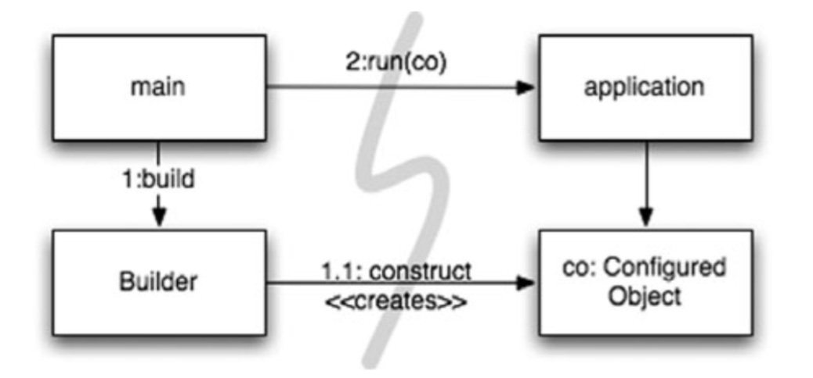
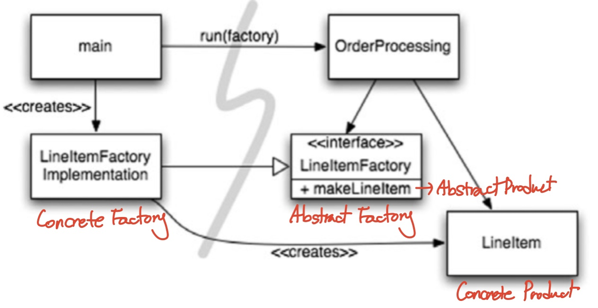

# 11. 시스템
- `복잡성은 죽음이다. 제품을 계획하고 제작하고 테스트하기 어렵게 만든다`
## 도시를 세운다면
- 거대한 도시는 적절한 추상화와 모듈화로 돌아간다
- 소프트웨어 팀도 도시처럼 구성한다
- 시스템 수준에서의 깨끗함(높은 추상화에서의 관심사의 분리)가 중요하다

## 시스템 제작과 시스템 사용을 분리하라
- 제작과 사용은 아주 다르다
- 소프트웨어 시스템은 준비과정(애플리케이션 객체를 제작하고 의존성을 서로 연결)과 런타임 로직(준비과정 이후에 이어지는)을 분리해야한다.
- 초기화 지연(Lazy Initialization) 을 예시로 봐보자
```java
    public Service getService() {
    	if(service == null)
    		service = new MyServiceImpl(...);
    	return service;
    }
```
### 장점
1. 필요할 때까지 객체 생성 X - 부하 없음. 빨라짐.
2. null 포인터 반환 X
### 단점
1. getService 메서드가 MyServiceImpl과 생성자 인수에 의존함.
-  런타임 로직에서 MyServiceImpl 객체를 사용하지 않더라도 의존성 해결 없이는 컴파일이 안됨.
2. 테스트 시 MyServiceImpldl이 무거운 객체라면 단일 책임 원칙 위배 - 테스트 전용 객체 생성을 한다.
3. 모든 상황에서 MyServiceImpl가 적합한지 모름 - 런타임 로직 + 객체생성 로직 이 섞이면 모든 실행 경로를 테스트해야 한다.
4. 모듈성 ↓, 중복 多(설정방식이 곳곳에 흩어지게 되고 모듈성 저하와 중복으로 이어진다)
- 설정 논리는 일반 실행 논리와 분리해야 모듈성이 높아진다

### Main 분리

- 시스템 생성과 시스템 사용을 분리하는 방법
- main 에서 필요한 객체를 생성한 후 애플리케이션에 넘긴다
- 애플리케이션은 main이나 객체가 생성되는 과정을 전혀 모르게되다(의존성 방향)
- 모든 의존성이 main → 애플리케이션

### 팩토리

- 떄로는 객체가 생성되는 시점을 애플리케이션이 결정할 필요도 생긴다.
- 객체 생성 시점을 애플리케이션이 결정할 필요가 있을 때 Abstract Factory 패턴을 사용하여 생성 코드를 감춘다
  - OrderingProcessing 애플리케이션은 객체 LineItem이 생성되는 구체적인 방법을 모른다
- Abstract Factory 추상 팩토리 : 구체적인 클래스에 의존하지 않고 서로 연관되거나 의존적인 객체들의 조합을 만드는 인터페이스를 제공하는 패턴
  - 관련성 있는 객체를 일관성 있는 방식으로 생성하는 경우에 유용
  - 생성 패턴의 하나
  - 수행하는 작업
    - AbstractFactory : 실제 팩토리 클래스의 공통 인터페이스
    - ConcreteFactory : 구체적인 팩토리 클래스로 AbstractFactory 클래스의 추상 메서드를 오버라이드함으로써 구체적인 제품을 생성한다.
    - AbstractProduct : 제품의 공통 인터페이스
    - ConcreteProduct : 구체적인 팩토리 클래스에서 생성되는 구체적인 제품
- 모든 의존성이 main → orderProcessing 애플리케이션

### 의존성 주입
- IoC 를 통해 의존성을 주입(DI)를 하면 사용과 제작을 강력하게 분리할 수 있다
- 스프링이 대표적인 예시
- 이를 통해 SRP 원칙을 지킨다
- 클래스가 의존성을 해결하려 하지 않는다(수동적인존재)
- 의존성을 주입하는 방법으로 설정자(setter)메서드나 생성자 인수를 사용한다.

## 확장
- 마을이 얼마나 넓어질지 몰르기때문에 도로를 6차선으로 처음부터 지을 수 없다
- 그렇다고 나중에 왜 진작에 6차선으로 안지었는지 후회할지도 모르는 일
- 결론은 오늘 주어진 사용자 스토리에 맞춰 시스템을 구현하고
- 내일은 새로운 스토리에 맞춰 시스템을 조정하고 확정햐여한다
- 이를 위해 TDD POJO 에 대한 이야기를 하게 된다.
- 소트프웨어는 물리적인 시스템과 달리 관심사를 적절히 분리해 관리한다면 아키텍처를 점진적으로 발전시킬 수 있다.

## 횡단(cross-cutting) 관심사
- 영속성과 같은 관심사는 애플리케이션의 자연스러운 객체 결계를 넘나드는 경향이 있다
- 현실적으로 영속성 방식을 구현한 코드가 온같 객체로 흩어진다
- 여기서 횡단 관심사라는 용어가 나온다
- 영속성 프레임워크도 모듈화가 가능하고 도메인 논리도 모듈화가 가능하다. 문제는 이 두영역이 세밀한 단위로 겹치게 된다.
- 우리는 AOP 에서 관점이라는 모듈 구성 개념은 특정 관심사를 지원하려면 시스템에서 특정 지점들이 동작하는 방식을 일관성 있게 바꾸라고 한다
- 예를 들어 영속성 책임을 영속성 프레임워크에 위임하면 AOP 프레임워크는 대상 코드에 영향을 끼지치 않는 상태로 동작방식을 변경한다.
- 어떤 메카니즘으로?

## 자바 프록시
- 순수 자바로 주요 비즈니스로직은 POJO 로 구성한다
- 그리고 해당 구현체를 감쌀 인터페이스를 만든다.
- 코드가 많고 복잡하며 프록시를 사용하면 깨끗한 코드를 작성하기 어렵다
- 동시에 시스템 단위로 실행 지점을 명시하는 메커니즘도 제공하지 않는다(스프링 짱짱맨)

## 순수 자바 AOP vmfpdladnjzm
- 대부분의 프록시 코드는 판박이라 도구로 자동화한다
- POJO 는 순수하게 도메인에 집중한다.
- 따라서 테스트가 개념적으로 쉽고 간단하다.
- 설정 파일이나 기반 구조를 포함하는데 AOP 를 활용한다. 
- 즉 프레임워크가 사용자 모르게 프록시나 바이트코드 라이브러리로 후루룩 구현을 한다.
- 실제 스프링에서 xml 빈설정을 하면
- 클라이언트게 Bank 에 접근하더라도 수많은 외부 설정이 붙은 중첩 DECORATOR 객체 집합의 가장 외곽과 통신한다.
- 어차피 비즈니스 로직은 순수 POJO 이니 바꾸기도 쉽다

## AspectJ 관점

## 테스트 주도 시스템 아키텍처 구축
- POJO 로 도메인 논리를 작성하면 코드 수준에서 아키텍처 관심사를 분리할 수 있다.
- 이는 진정한 테스트 주도 아키텍처 구축으로 이어진다
- 그때그때 새로운 기술을 채택해 단순한 아키텍처를 복잡한 아키텍처로 키워갈 수 있다.
- 소프트웨어 구조가 관점을 효과적으로 분리한ㄷ면 극적인 변화가 경제적으로 가능하다

## 의사 결정을 최적화하라
- 모듈을 나누고 관심사를 분리하면 지엽적인 관리와 결정이 가능해진다
- POJO 를 통해 최선의 시점에 최적의 결정을 내리는게 쉬워진다.

## 시스템 도메인 특화 언어가 필요하다
- 애자일 기벙에서는 팀과 프로젝트 이해관계자 사이의 의사소통이 중요하다
- 이 간극을 줄여줄 도메인 중심의 DSL 을 활용하자
